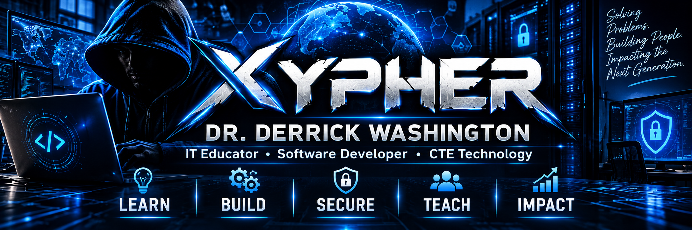

  

# 👋 Dr. Derrick Washington

### IT Educator | Software Developer | CTE Technology

Welcome to my GitHub.

I'm an IT educator and developer focused on creating practical
technology solutions and helping students develop real-world
technical skills.

## 💻 Technology Stack

- Python
- C#
- Flask
- SQL
- Computer Maintenance
- CompTIA A+
- CompTIA Security+
- Networking
- Cybersecurity
- Data Analytics

## 🚀 Featured Projects

### CTE Student Success Dashboard
A web-based application designed to help CTE educators track
student performance, certifications, interventions, and progress.

### BRJ Troubleshooting Lab
A hands-on IT support environment that allows students to
diagnose real-world workstation and network problems.

### BRJ Help Desk
A classroom help-desk environment integrating troubleshooting,
ticketing, documentation, and technical support workflows.

## 🎓 Teaching & Technology

My work focuses on connecting:

**Education • Technology • Leadership • Real-World Skills**

> "Solving Problems. Building People. Impacting the Next Generation."

---

### XYPHER

**Learn • Build • Secure • Teach • Impact**
